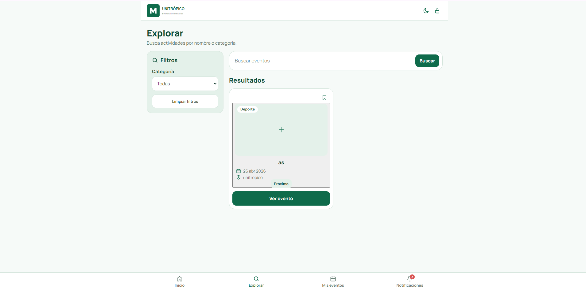
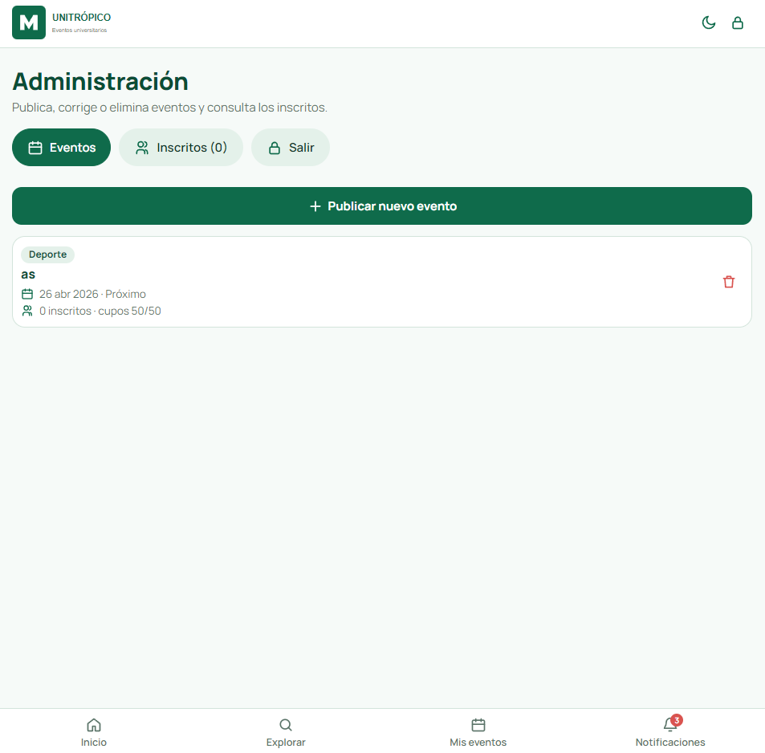

## Wireframes
Capturas del prototipo en funcionamiento. Se puede probar en el [enlace de GitHub Pages]( https://natalia-caicedo.github.io/proyecto-bienestar/).

| Archivo | Pantalla |
|---------|----------|
| [`01-inicio.png`]| **Inicio:** buscador y lista de próximos eventos (con estado vacío). |
| [`02-explorar.png`]| **Explorar:** búsqueda por nombre y filtro por categoría. |
| [`03-nuevo-evento.png`]| **Nuevo evento:** formulario del organizador (título, categoría, fecha, horario, lugar, sede, estado, cupos y descripción). |
| [`04-administracion.png`]| **Administración:** publicar eventos, eliminarlos y consultar inscritos. |

## Inicio

## Explorar

## Nuevo evento

## Administración

